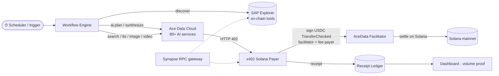

<div align="center">

# Synapse AutoAgent

**An autonomous on-chain Solana agent that discovers tools via SAP, runs AI workflows on Ace Data Cloud, and settles every call with x402 — end-to-end, no human in the loop.**

Built for the [OOBE × Ace Data Cloud Autonomous Agent Bounty](https://superteam.fun/earn/listing/autonomous-agent-bounty-oobe-ace-data-cloud) · **Category 2: Ace Data Cloud Usage (x402 facilitator)**

`SAP mainnet` · `x402` · `Ace Data Cloud` · `Synapse RPC` · `TypeScript` · `Solana`

</div>

---

## What it does

`trigger → discover → plan → execute → pay → settle → record` — fully autonomous.

On a schedule (no manual input), the agent:

1. **Discovers** available agents/tools on the **Synapse Agent Protocol (SAP)** via the on-chain Explorer.
2. **Plans** the run with an **LLM** (the AI capability) — turning a goal into concrete steps.
3. **Executes** an AI workflow that consumes **≥3 distinct Ace Data Cloud services** (web search, LLM synthesis, text-to-speech, image, video).
4. **Pays per call with x402** through **Ace Data Cloud's own facilitator** on Solana — the user spends **zero SOL gas** (the facilitator sponsors the fee).
5. **Records** an immutable receipt for every payment and aggregates **service-consumption volume** — the exact metric Category 2 rewards.

Two flagship workflows ship in [`workflows/`](workflows/): an **Autonomous Research Brief** (search → synthesize → narrate) and a **Content Studio** (copy → image → voiceover).

## How it maps to the bounty (Category 2)

| Requirement | Where |
|---|---|
| Registered on **SAP mainnet** | [`@autoagent/sap`](packages/sap/src/register.ts) · `npm run register` |
| **Complete automated workflow** (trigger → execute → pay, no manual steps) | [`@autoagent/core` engine](packages/core/src/engine.ts) + [`apps/agent`](apps/agent/src/main.ts) |
| **x402 via AceData's own facilitator** + **Synapse RPC** in execution | [`@autoagent/x402` payer](packages/x402/src/solana-payer.ts) + [`@autoagent/wallet` connection](packages/wallet/src/connection.ts) |
| **≥3 distinct Ace Data Cloud services** | [`@autoagent/acedata` catalog](packages/acedata/src/services.ts) — chat, search, TTS, image, video |
| **AI capability** | LLM planner step (`ai.plan`) + LLM synthesis |

> **The x402 flow is the verified one.** Research (see [docs/INTEGRATION-GUIDE.md](docs/INTEGRATION-GUIDE.md)) confirmed that AceData's Solana x402 form — a `serializedTransaction` with the facilitator as fee payer — is what actually settled on mainnet. This repo implements exactly that. (It also corrects a common misconception: OOBE's *own* x402 RPC server uses the **PayAI** facilitator, not AceData's — so that's kept separate and supporting-only.)

## Architecture



A clean monorepo with no dependency cycles — integration packages never import the engine; the app wires them in:

```
packages/
  config/    verified constants (program IDs, mints, facilitators) + zod env
  wallet/    keypair load · SOL/USDC balances · Synapse RPC connection
  core/      types · logger · receipt ledger · spend guard · workflow engine · templating
  x402/      VERIFIED raw Solana x402 payer (AceData) + OOBE RPC 402 inspector
  acedata/   Ace Data Cloud client: chat · search · TTS · image · video
  sap/       SAP mainnet registration (low-level) + Explorer discovery
apps/
  agent/     the autonomous runner: handlers, YAML workflow loader, scheduler
  dashboard/ live volume + receipts + registration proof (Express + 1 page)
workflows/   declarative YAML workflows (add one → no code change)
scripts/     doctor · inspect-402 · register-agent · check-balances · report-volume
```

## Quickstart

```bash
npm install
cp .env.example .env          # defaults run in safe DRY-RUN

# 1) See it run end-to-end (simulated payments, real price discovery if reachable)
npm run agent:once

# 2) Inspect the live x402 price of any service (no payment)
npm run inspect:402 -- chat

# 3) Watch the volume dashboard
npm run dashboard             # → http://localhost:4040
```

**Going live** (real mainnet USDC volume) — see [docs/RUNBOOK.md](docs/RUNBOOK.md):

```bash
# .env: add SYNAPSE_RPC, SOLANA_KEYPAIR_PATH (funded), set DRY_RUN=false
npm run doctor                # preflight: wallet, balances, RPC, AceData gate, SAP status
npm run register              # register the agent on SAP mainnet (~0.1 SOL)
npm run agent                 # start the autonomous scheduler → generates real volume
npm run report                # volume by category + AceData service + tx links
```

## Commands

| Command | What |
|---|---|
| `npm run agent` | Start the autonomous scheduler (runs interval workflows forever) |
| `npm run agent:once` | Run every workflow once and exit |
| `npm run agent -- --list` | List available workflows |
| `npm run doctor` | Preflight every prerequisite without spending |
| `npm run inspect:402 -- <service>` | Read a service's live x402 price (no payment) |
| `npm run register` | Register the agent on SAP mainnet |
| `npm run report` | Volume report from the receipt ledger |
| `npm run dashboard` | Live proof-of-volume UI |
| `npm run typecheck` · `npm test` · `npm run lint` | Quality gates |

## Safety — it moves real money, carefully

- **DRY_RUN by default.** Nothing settles until you set `DRY_RUN=false`.
- **Spend guardrails** (`MAX_USDC_PER_CALL` / `_RUN` / `_DAY`) are enforced **before** any transaction is signed — the agent reads the 402 price and refuses over-budget quotes.
- **Every payment is receipted** to an append-only ledger with the on-chain signature, so volume is auditable.
- Secrets (`.env`, `keys/`) are gitignored; the x402 payer never logs private keys.

## Docs

- [docs/INTEGRATION-GUIDE.md](docs/INTEGRATION-GUIDE.md) — source-verified reference for the whole stack
- [docs/ARCHITECTURE.md](docs/ARCHITECTURE.md) — design, data flow, extension points
- [docs/RUNBOOK.md](docs/RUNBOOK.md) — go from zero to real on-chain volume
- [docs/DEMO-SCRIPT.md](docs/DEMO-SCRIPT.md) — the walkthrough the bounty asks for
- [docs/SUBMISSION.md](docs/SUBMISSION.md) — submission summary
- [TODO.md](TODO.md) — build tracker

## License

MIT
